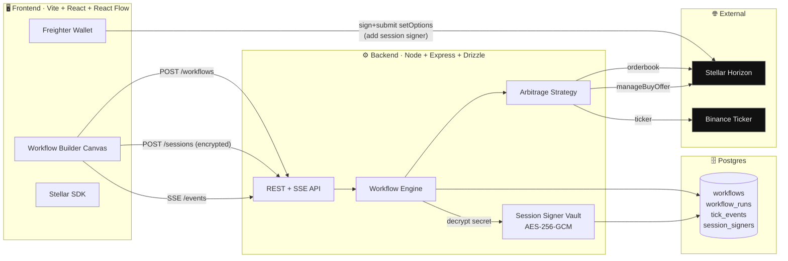
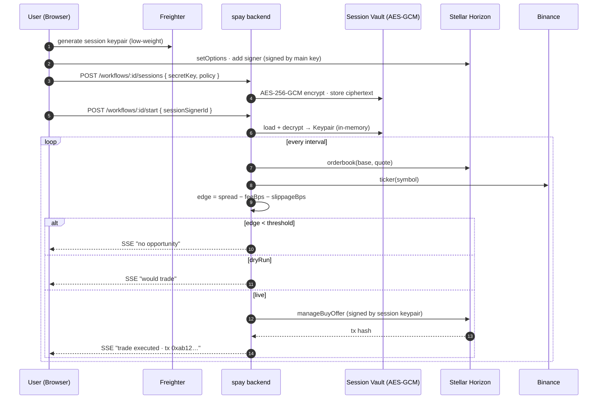
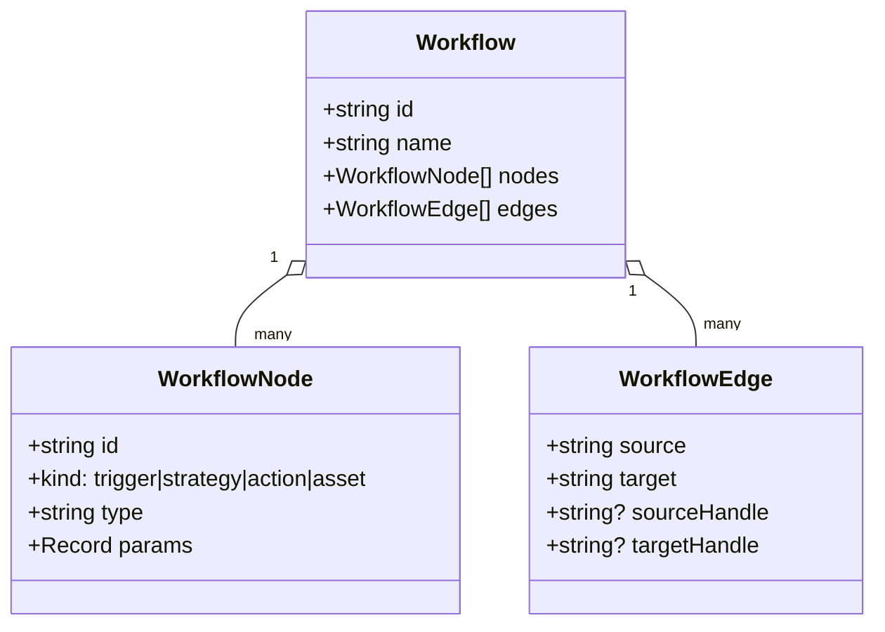
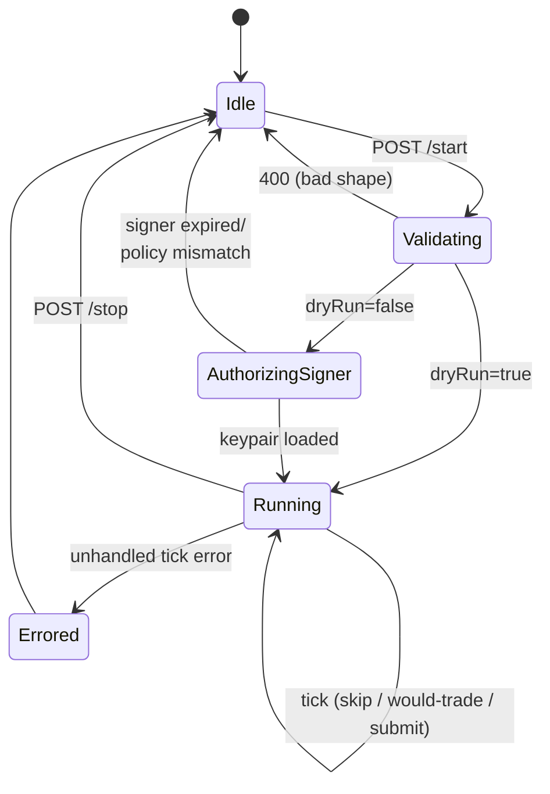

<div align="center">

# spay

### **Programmable on-chain workflows on Stellar.**

*Build automated trading & payment flows like you build Figma frames — drag, connect, ship.*

[](https://stellar.org)
[](https://nodejs.org)
[](https://pnpm.io)
[](#)

</div>

---

## What is this?

`spay` (formerly FlowPay) is a **workflow-based trading & payment engine on Stellar**. You compose nodes on a canvas — *triggers*, *strategies*, *assets*, *actions* — connect them with wires, and the backend runs them as **real Stellar transactions** on every tick.

Today's strategies:

- **DEX ↔ Binance arbitrage** — compare Stellar DEX top-of-book vs Binance reference, skim the spread above a configurable threshold (after fees & slippage).
- **Time-triggered execution** — run any workflow on a fixed cadence.
- **Dry-run by default** — every workflow ships with `dryRun: true`; you flip the switch only after you've watched ticks roll past.

Tomorrow's: payment-triggered payouts, threshold rebalancing, multi-leg strategies — all just more nodes on the same canvas.

---

## Architecture at a glance



The frontend is the canvas. The backend is the engine + custodian. Postgres is the source of truth. Stellar Horizon is the chain. Binance is the reference oracle for arbitrage.

---

## How a tick fires (sequence)



---

## The workflow model

A workflow is just `{ name, nodes, edges }` — same shape on the wire, in Postgres, and on the React Flow canvas.



| Node kind  | What it is                                                | Examples                                       |
| ---------- | --------------------------------------------------------- | ---------------------------------------------- |
| `trigger`  | When the workflow ticks                                   | `time_interval`, `payment` *(stub)*            |
| `strategy` | The decision logic running on each tick                   | `arbitrage`                                    |
| `action`   | A side-effect emitted by the strategy                     | `trade`, `transfer`                            |
| `asset`    | Declares a Stellar asset context (`code`, optional issuer)| `XLM`, `USDC:GA5ZSE…`                          |

Wires from `asset` nodes into a strategy's `base` / `quote` handles **derive the trading pair automatically** — no need to hand-type `XLM/USDC` in params.

---

## Engine state machine



Validation is strict: exactly **one trigger** + exactly **one strategy** per workflow today. Multiple actions are fine — strategies emit, the engine routes. Live execution requires a session signer that matches the workflow's pair and notional cap.

---

## Quickstart

### Prerequisites

- Node.js 18+ (tested on 24)
- pnpm 10 — `corepack enable && corepack prepare pnpm@10.26.1 --activate`
- Postgres database (`.env.example` is wired for Supabase pooler on port 6543)
- *(Optional, for live trades)* a Stellar testnet account funded via [friendbot](https://laboratory.stellar.org/#account-creator?network=test)

### Setup

```bash
git clone <repo-url>
cd "Flow trade"
pnpm install
cp .env.example .env

# generate a key for the session-signer vault
openssl rand -hex 32   # paste into SESSION_ENCRYPTION_KEY

# apply migrations
psql "$DATABASE_URL" -f backend/drizzle/0000_init.sql
psql "$DATABASE_URL" -f backend/drizzle/0002_waitlist.sql
```

### Run

```bash
# terminal 1 — backend → http://localhost:3001
pnpm dev:backend

# terminal 2 — frontend → http://localhost:5173
pnpm --filter frontend dev

# sanity
curl -s http://localhost:3001/health
```

Open `http://localhost:5173`, join the waitlist, then `/app` for the builder.

---

## Environment

| Variable                 | Required | Purpose                                                          |
| ------------------------ | :------: | ---------------------------------------------------------------- |
| `PORT`                   |          | Backend HTTP port (default `3001`)                               |
| `STELLAR_NETWORK`        |    ✓     | `testnet` or `public`                                            |
| `HORIZON_URL`            |    ✓     | Stellar Horizon endpoint                                         |
| `BINANCE_API_URL`        |    ✓     | External price source for arbitrage reference                    |
| `DATABASE_URL`           |    ✓     | Postgres connection (Supabase pooler on `6543` recommended)      |
| `SESSION_ENCRYPTION_KEY` |    ✓     | ≥32-char material for AES-256-GCM of session-signer secrets      |
| `VITE_API_URL`           |          | Frontend override; defaults to `http://localhost:3001`           |

> ⚠️ Rotating `SESSION_ENCRYPTION_KEY` invalidates **every** stored ciphertext (auth-tag mismatch on decrypt). Rotate only alongside a wipe of `session_signers`.

---

## HTTP surface

All routes mounted in `backend/src/index.ts`. No auth today — bind to localhost or put it behind your own gateway.

| Method   | Path                                       | Purpose                                              |
| -------- | ------------------------------------------ | ---------------------------------------------------- |
| `GET`    | `/health`                                  | Liveness                                             |
| `POST`   | `/workflows`                               | Create workflow (`{ name, nodes, edges }`)           |
| `GET`    | `/workflows`                               | List                                                 |
| `GET`    | `/workflows/:id`                           | Detail                                               |
| `PUT`    | `/workflows/:id`                           | Replace nodes / edges / name                         |
| `DELETE` | `/workflows/:id`                           | Stops if running, then deletes                       |
| `POST`   | `/workflows/:id/start`                     | Begin run (`{ sessionSignerId? }` in body)           |
| `POST`   | `/workflows/:id/stop`                      | Halt run                                             |
| `GET`    | `/workflows/:id/status`                    | `{ running, startedAt? }`                            |
| `GET`    | `/workflows/:id/events`                    | **SSE** stream of live tick/decision events          |
| `GET`    | `/workflows/:id/runs`                      | Last 50 runs with `eventCount`                       |
| `POST`   | `/workflows/:id/sessions`                  | Upload encrypted session signer                      |
| `GET`    | `/workflows/:id/sessions`                  | List non-revoked signers                             |
| `DELETE` | `/workflows/:id/sessions/:sessionId`       | Revoke                                               |
| `GET`    | `/runs/:runId/events`                      | Paginated event log (`limit`, `before`)              |
| `POST`   | `/waitlist`                                | Public waitlist signup (rate-limited)                |

---

## Session signers — how trades-on-behalf-of-user work

The backend never holds the user's primary Stellar key. It holds a **scoped, time-boxed delegate** that the user explicitly authorizes on-chain.

```mermaid
flowchart TD
  A[User generates session keypair] --> B[User signs setOptions:<br/>add session pubkey as signer<br/>weight 1, med threshold 1]
  B --> C[POST /workflows/:id/sessions<br/>{ secretKey, policy: pair, maxNotional, ttl }]
  C --> D{Backend validates}
  D -->|invalid| X[400]
  D -->|ok| E[AES-256-GCM encrypt<br/>store with expiresAt]
  E --> F[Return sessionSignerId + publicKey]
  F --> G[POST /workflows/:id/start { sessionSignerId }]
  G --> H{Liveness gates}
  H -->|expired/revoked/<br/>policy mismatch| X
  H -->|ok| I[Decrypt → in-memory Keypair]
  I --> J[Tick loop signs<br/>manageBuyOffer]
  J --> K[Submit to Horizon]

  style E fill:#0a0a0a,stroke:#888,color:#fff
  style I fill:#0a0a0a,stroke:#888,color:#fff
  style K fill:#0a0a0a,stroke:#888,color:#fff
```

### The conditions that must hold for a real trade to fire

1. Workflow shape valid: exactly one `time_interval` trigger + one `arbitrage` strategy with derivable pair.
2. `dryRun: false` in strategy params.
3. `sessionSignerId` provided on `/start`.
4. Signer row alive: not revoked, `expiresAt > now`, TTL ≤ 240 min (4h cap).
5. `policy.pair` matches workflow pair; `notional ≤ policy.maxNotional`.
6. `SESSION_ENCRYPTION_KEY` unchanged since storage (else AES-GCM auth fails).
7. Session pubkey is an actual signer on the source account on-chain with sufficient weight.
8. Stellar orderbook has both sides; Binance ticker reachable; net edge ≥ threshold; direction is `buy_stellar_sell_binance` (sell-leg is intentionally not submitted).
9. Horizon accepts the tx within the 30s timebound.

> Full deep-dive in [`docs/transactions-on-behalf-of-user.md`](./docs/transactions-on-behalf-of-user.md).

---

## Repo layout

```
spay/
├─ backend/
│  ├─ src/
│  │  ├─ index.ts              # Express app · routes · health · error handler
│  │  ├─ config.ts             # env parsing (zod-ish)
│  │  ├─ db/                   # drizzle client + schema
│  │  ├─ engine/               # workflow engine + triggers
│  │  ├─ strategies/arbitrage  # Stellar DEX vs Binance loop
│  │  ├─ services/             # stellar · binance · session crypto
│  │  └─ routes/               # /workflows · /runs · /waitlist
│  └─ drizzle/                 # SQL migrations
├─ frontend/
│  └─ src/
│     ├─ pages/                # Landing · WorkflowBuilder
│     ├─ nodes/                # Trigger · Strategy · Action · Asset (React Flow)
│     ├─ components/ ui/       # primitives + composed components
│     └─ api/ store/ lib/      # API client · Zustand store · utilities
├─ shared/types.ts             # shared Workflow / node / edge types
├─ docs/
│  └─ transactions-on-behalf-of-user.md
└─ pnpm-workspace.yaml
```

---

## Tech stack

**Backend** — Node 18+ · Express 4 · Drizzle ORM · Postgres · Stellar SDK 15 · Pino · Zod
**Frontend** — Vite 6 · React 18 · React Router 6 · Zustand · React Flow (`@xyflow/react`) · Framer Motion · Freighter
**Tooling** — pnpm 10 workspaces · TypeScript 5.7 · `tsx` watch · `drizzle-kit`

---

## Safety

- 🟢 **Default to `dryRun: true`** on new workflows. Watch tick logs in the SSE stream before flipping live.
- 🟢 **Use testnet** (`STELLAR_NETWORK=testnet`, `HORIZON_URL=https://horizon-testnet.stellar.org`) until you're sure.
- 🟡 **Low-liquidity pairs** can fill worse than the top-of-book tick suggested — `feeBps` and `slippageBps` are estimates, not guarantees.
- 🔴 **Never commit a real secret key.** Always go through `/sessions` so it lands in the encrypted vault.
- 🔴 **No HTTP auth today.** Don't expose the backend port directly to the internet.

---

## Scripts quick reference

```bash
pnpm install                                       # install workspace deps
pnpm dev:backend                                   # backend dev (tsx watch)
pnpm --filter frontend dev                         # frontend dev (vite)
pnpm --filter frontend build                       # typecheck + vite build
pnpm --filter backend exec tsc --noEmit            # backend typecheck
pnpm --filter backend exec drizzle-kit generate    # new SQL migration from schema
```

---

<div align="center">

**Built on Stellar.** Designed like a tool you actually want to use.

</div>
